# Тестування працездатності системи

Для перевірки працездатності використовується застосунок Postman.

Перевірятись будуть таблиці **role**, **permission** та **grant**

## Role

### POST
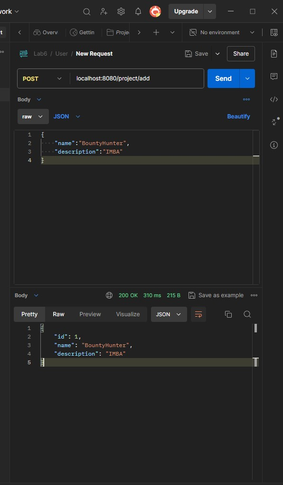

### GET (all)
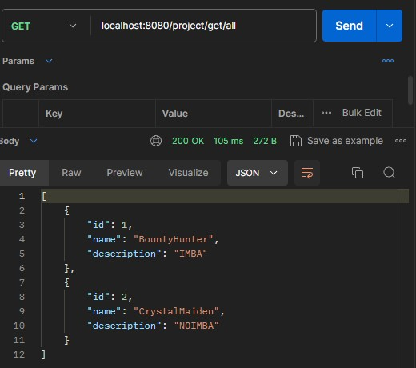

### GET (id)
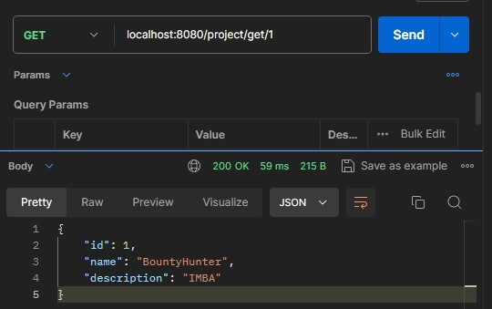

### PUT
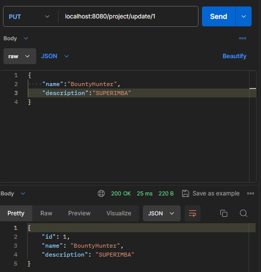

### DELETE
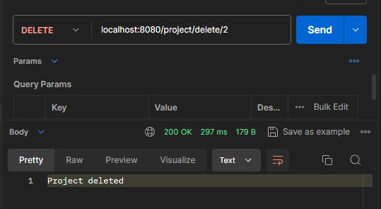

## Permission

### POST
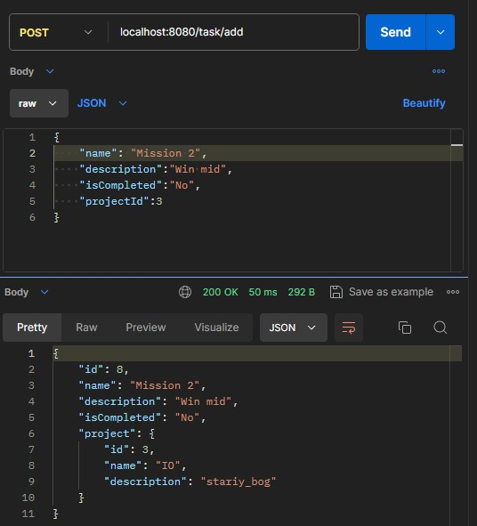

### GET (all)
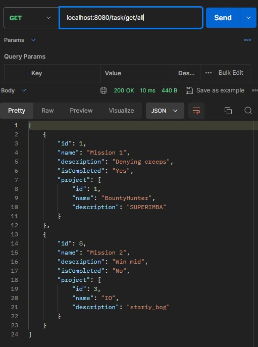

### GET (id)
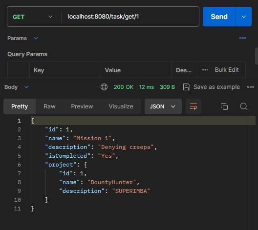

### PUT
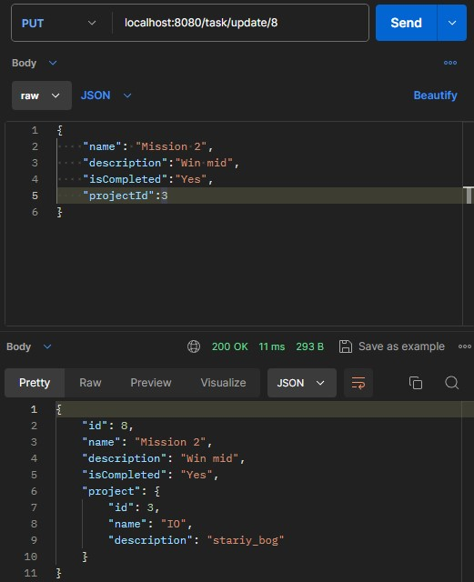

### DELETE
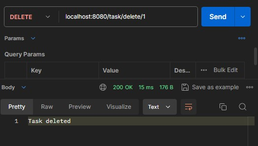

## Grant

### POST
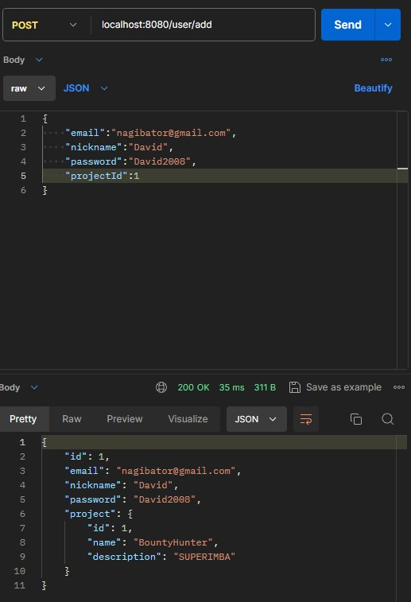

### GET (all)
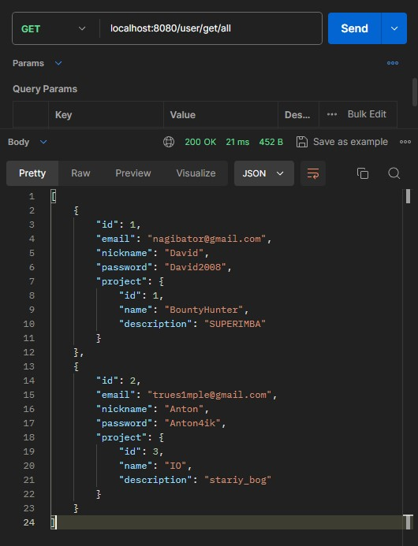

### GET (id)
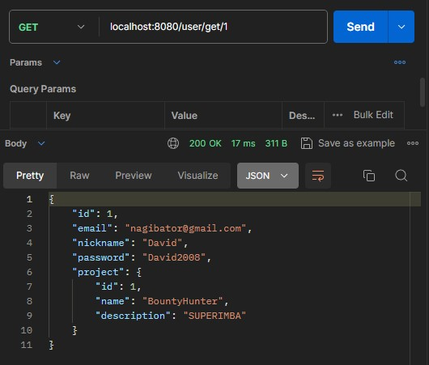

### PUT
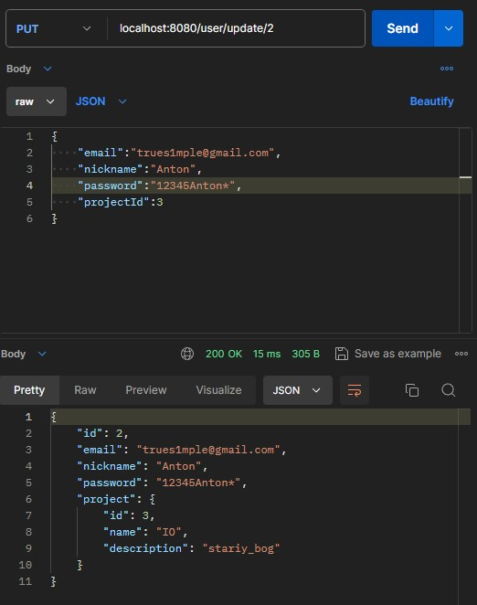

### DELETE
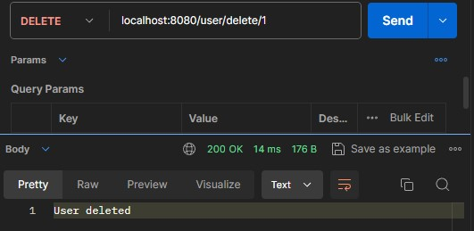
